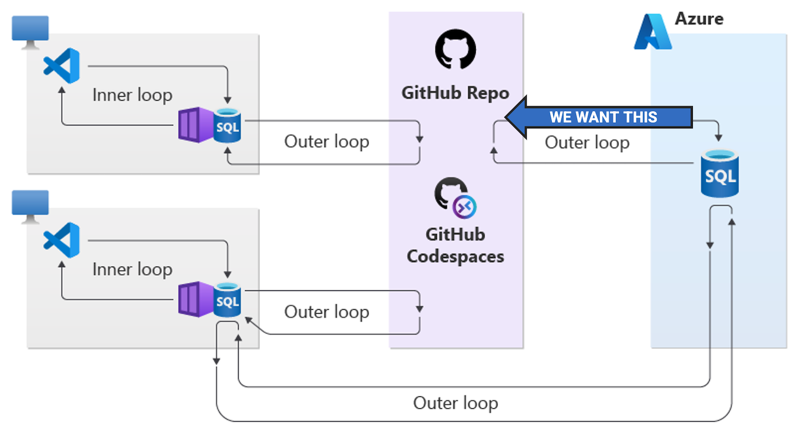

# SQL Source Control

This repository is a demo of how to get your database code into source control when you're looking for a first step to getting started with DevOps for your SQL database.



## Prerequisites

### 📦 SqlPackage command line tool for Windows, macOS, and Linux

**Install**

```bash
dotnet tool install -g microsoft.sqlpackage
```

**Learn more**

- [SqlPackage docs](https://aka.ms/sqlpackage-ref)
- [DacFx feedback repository](https://github.com/microsoft/dacfx)

### Base dev tools

You may already have these installed, but if not, you'll need them to try this in your own environment.

- VS Code and/or Azure Data Studio
- git source control CLI

## 🛠️ Convert your database to code

```bash
sqlpackage /a:extract /ssn:localhost /sdn:AdventureWorks /su:sa /sp:Passw0rd /stsc:true /tf:AdventureWorks /p:ExtractTarget=ObjectType
```

- `/a:extract` specifies the action to perform a schema extraction with `/p:ExtractTarget=ObjectType` organizing the files into folders by object type
- `/tf:AdventureWorks` sets the output location to the [AdventureWorks](AdventureWorks) folder

## Optional steps

### 🤖 Setup an automated process to check the database into source control

Leverage an automation environment (GitHub Actions, Azure DevOps Pipelines) to run the `sqlpackage` command and check the results into source control or open a PR for you to review.

The [GitHub Actions workflow](.github/workflows/database-pr.yml) in this repo is an example of how to do this, where the workflow steps are:

1. Checking out the repo files into the automated environment
2. Setting a timestamp variable to use as a branch name
3. Reset the database files in the environment by removing them
4. Run the `sqlpackage` command to extract the database schema to the pipeline environment
5. Use `git status` to see if there are changes
6. If there are changes, create a new branch with the timestamp as the name and commit the changes to the branch
7. If there are changes, open a PR to the main branch as 'Database Status Bot'
8. Output a summary to the workflow log

### Convert the folder of files to a SQL project


> Environment prerequisite: .NET SDK and .NET SQL project template
>
> Install the .NET SQL project template with: `dotnet new install microsoft.build.sql.templates`

We will add a .sqlproj file to the folder with our database objects, enabling the files to be built into a package for unit tests, deployment, etc.

```bash
dotnet new sqlproj -n AdventureWorks
```

### Run unit tests on your database code

> Prerequisite: SQL project file on your database code

Layering a unit test project and set of unit tests on your database code enables you to test your database code in either an ad-hoc or automated manner.  This is a great way to ensure your database code is working as expected.

There is a very small example of utilizing the [tSQLt unit test framework](https://tsqlt.org/) in the [UnitTests](UnitTests) folder and with the [unit-tests.yml](.github/workflows/unit-tests.yml) GitHub Actions workflow.

In this repository, the unit tests example is more of an aspirational future state than the first step.  The first step is to get your database code into source control and then you can layer on unit tests or any other DevOps concepts that are right for your environment.