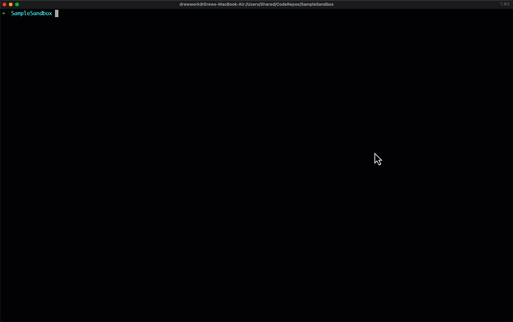

# 🛠️ Convert your database to code

At the end of this quickstart, you will be able to convert your database to code using the `sqlpackage` command line tool.



## 😨 the command line!?!

If you're not familiar with the command line, don't worry! We're only going to use a few commands, and we'll walk through them together.

Although SqlPackage/DacFx operations are available in common GUI tools (SSMS, Azure Data Studio), we'll use the command line to make it easier to automate the process later and access more advanced options.

### Windows

On Windows, the **Terminal** application is available in the Microsoft Store and is automatically installed on recent builds of Windows 11.

### macOS
On macOS, the **Terminal** application is automatically installed. You can also use **iTerm**.

## Linux

On Linux, you can use your terminal of choice for this quickstart.

## Install 📦 SqlPackage

`dotnet tool` install of SqlPackage requires the .NET SDK. If you don't have the .NET SDK installed, you can download it from [dotnet.microsoft.com](https://dotnet.microsoft.com/download).

Run the following command to install SqlPackage:

```bash
dotnet tool install -g microsoft.sqlpackage
```

## Gather connection information about your database

We'll need to know the following information about the database we want to convert to code:
- server name
- database name
- SQL authentication username
- SQL authentication password

In the SqlPackage command, we will use the following parameters to specify this information:
- /SourceServerName (/ssn)
- /SourceDatabaseName (/sdn)
- /SourceUser (/su)
- /SourcePassword (/sp)

For most development databases and environments without trusted SSL certificates installed, you will need an additional parameter for trusting the source server certificate - /SourceTrustServerCertificate (/stsc).

*In more advanced scenarios, you may use Azure Active Directory authentication with SqlPackage by using the /SourceConnectionString (/scs) parameter instead of the parameters listed above.*

## 🏃 Run SqlPackage

Using the parameters gathered in the previous section, we can construct a SqlPackage command that connects to the source database and extracts the definitions of the database objects to files.


```bash
sqlpackage /a:extract /ssn:localhost /sdn:AdventureWorks /su:sa /sp:Passw0rd /stsc:true /tf:AdventureWorks /p:ExtractTarget=ObjectType
```

- `/a:extract` specifies the action to perform a schema extraction with `/p:ExtractTarget=ObjectType` organizing the files into folders by object type
- `/tf:AdventureWorks` sets the output location to a folder to be created by the operation

## Next steps

Now that you've converted your database to code, you can use the files in your source control and development processes.

Optionally, follow up with:
- [Check your database into source control](check-your-database-into-source-control.md)
- [Setup a pipeline to automatically check your database into source control](automate-your-database-source-control.md)
- [Deploy your database code to a container for development](deploy-to-a-container.md)
- [Add unit tests on your database](add-unit-tests-on-your-database.md)
